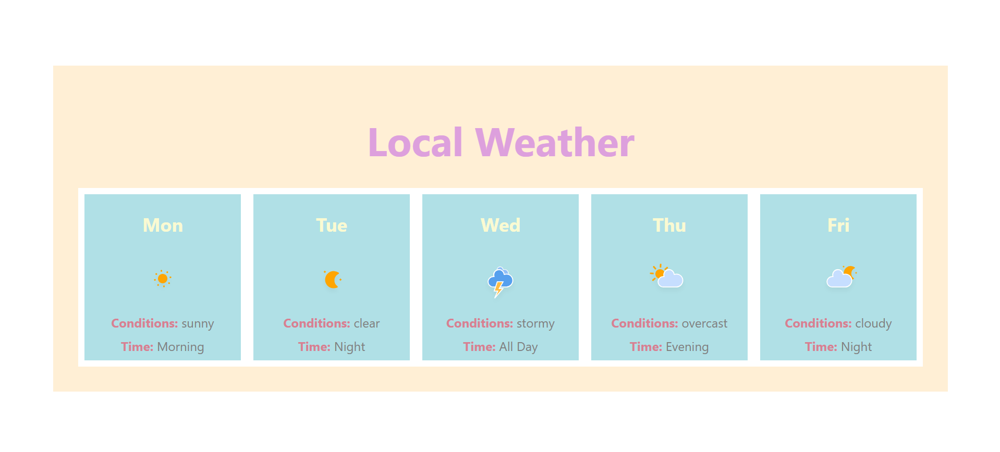

# Simple React Weather Forecast (LAB)

This lab  is a simple weather forecast application built with React. It displays a 5-day weather forecast with information.

## Below are notes, for personel future referencing.

### 1. **App Component**
- Maps over the weatherForecasts  array and passes data as props to the `WeatherForecast` component.

### 2. **WeatherForecast Component**
- Receives weather data as props and renders the following:
  - Day of the week
  - Weather icon image
  - Weather conditions 
  - Time of day 

## File Structure worked on

- `App.jsx`: Main component where the weather data is stored and passed to WeatherForecast
- `WeatherForecast.jsx`: Displays weather details for each day.
- `App.css`: Styles for the main app layout.
- `WeatherForecast.css`: Styles for the weather forecast component.

## How it works??

1. **Data Structure**: Weather data is stored in an array called `weatherForecasts`. Each item in the array contains data about a specific day.
2. **Rendering**: The `.map()` method is used to iterate over the `weatherForecasts` array and render a `WeatherForecast` component for each day.
3. **Props**: Weather data is passed as props to the `WeatherForecast` component for display.

